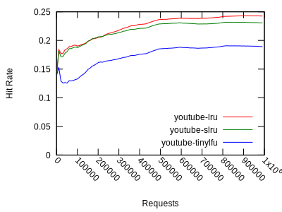

# Cache
[](https://godoc.org/github.com/goburrow/cache)
[](https://travis-ci.org/goburrow/cache)

Partial implementations of [Guava Cache](https://github.com/google/guava) in Go.

Supported cache replacement policies:

- LRU
- Segmented LRU (default)
- TinyLFU (experiment)

The TinyLFU implementation is inspired by
[Caffeine](https://github.com/ben-manes/caffeine) by Ben Manes and
[go-tinylfu](https://github.com/dgryski/go-tinylfu) by Damian Gryski.

## Download

```
go get -u github.com/goburrow/cache
```

## Example

```go
package main

import (
	"fmt"
	"math/rand"
	"time"

	"github.com/goburrow/cache"
)

func load(k cache.Key) (cache.Value, error) {
	return fmt.Sprintf("%d", k), nil
}

func report(c cache.Cache) {
	st := &cache.Stats{}
	c.Stats(st)
	fmt.Println(st)
}

func main() {
	// Create a new cache
	c := cache.NewLoadingCache(load,
		cache.WithMaximumSize(1000),
		cache.WithExpireAfterAccess(10*time.Second),
		cache.WithRefreshAfterWrite(60*time.Second),
	)

	getTicker := time.Tick(10 * time.Millisecond)
	reportTicker := time.Tick(1 * time.Second)
	for {
		select {
		case <-getTicker:
			_, _ = c.Get(rand.Intn(2000))
		case <-reportTicker:
			report(c)
		}
	}
}
```

## Efficiency

See [report](report/)



